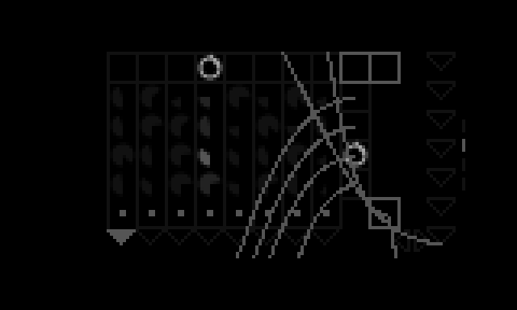

# washi

a serge-inspired sequencer toolbox.

the heart of it is a reproduction of the hale [8 Stage Complex Sequencing Programmer](https://www.modulargrid.net/s/hale-8-stage-complex-sequencing-programmer), itself based on the classic Serge Sequencer / Programmer.

