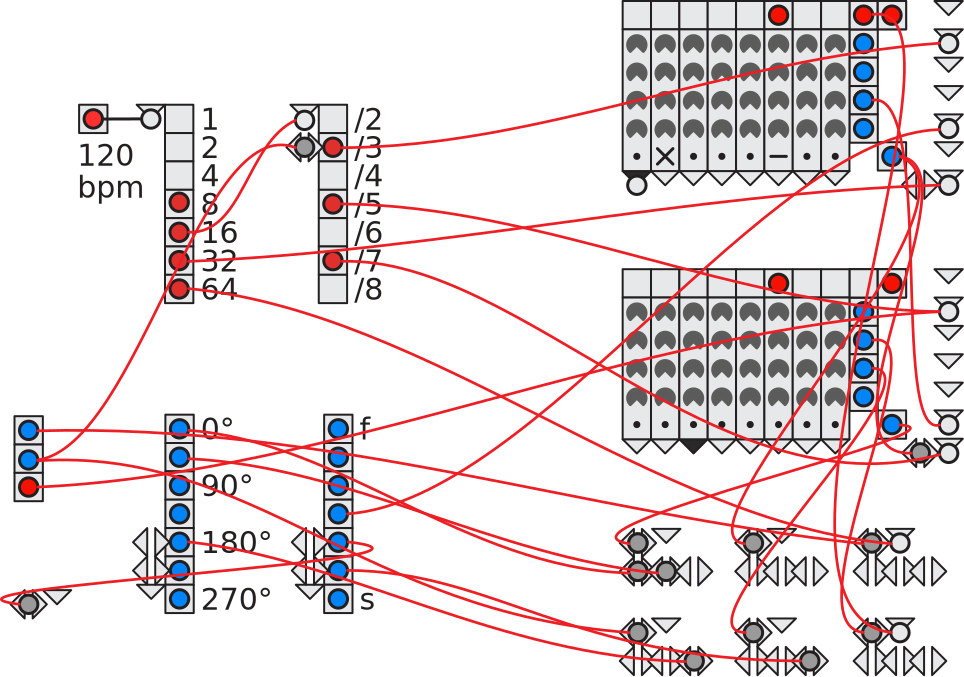
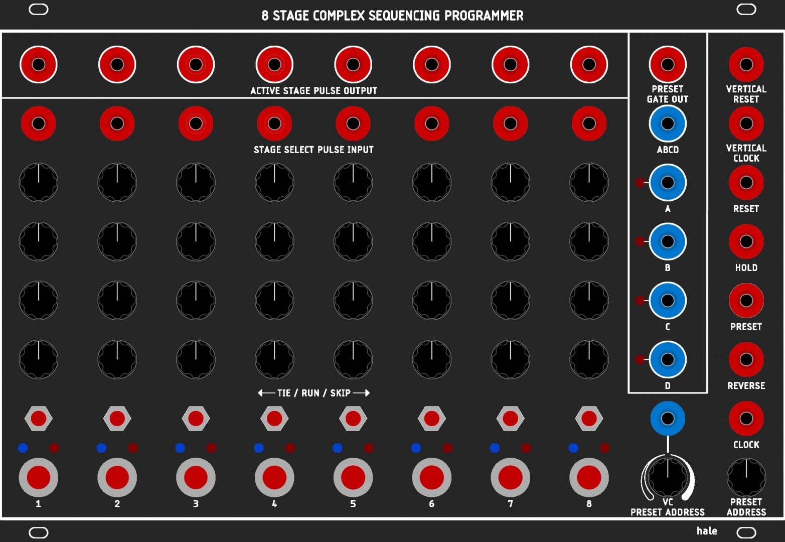

# washi

a serge-inspired sequencer toolbox for norns/seamstress.

- [PDF documentation](https://github.com/p3r7/washi-doc/blob/master/washi.pdf)
- [lines thread](https://llllllll.co/t/washi-beta/62971)

## installation

on norns, on can just:

    ;install https://github.com/p3r7/washi

using the cli:

    git clone --recursive https://github.com/p3r7/washi

(the `--recursive` flag is needed to retrieve dependency [nb](https://github.com/sixolet/nb))

if you did a clone without the `--recursive` flag, you can still do this afterward instead:

    cd washi
    git submodule update --init --recursive

## quick start

navigate to the params menu and go to the `outputs` section. enter one of the output submenu (e.g. `Output #1`) and set the `nb Voice` param to a midi device or nb voice (such as [emplaitress](https://llllllll.co/t/n-b-et-al-v0-1/60374) or [oilcan](https://llllllll.co/t/oilcan-percussion-co/60754)). yoçu should now hear sound.

you can then assign more outputs to more voices, generate a new random patch (`K1 + K3` on norns, `R` on seamstress), play around with various params and navigate to the different screens to interract with the whole patch (grid required for most operations).

### instructions (seamstress)

(incomplete)

- `S`: scope mode, click on any banana jack to see the signal, anywhere else to cancel
- `r`: random programmer/sequencer values
- `R`: randomize all (patch + programmer/sequencer values)
- `i`: initial patch
- `c`: clear all patch
- `UP`/`DOWN`: previous/next panel
- `left click`: link/unlink
- `right click`: scope

## known bugs

- self-patching a haleseq doesn't work
  need to implement the trig ins as a "clock-0" instruction, i.e. immediate callback on input change instead of waiting for next clock occurence

## implementation details

Removing a link interactively calls `patching.remove_link` which removes the `output -> input` association in the "model" synchronously, but this only takes effect on the state of concerned modules at the next patch evaluation (`patching.fire_and_propagate` / `patching.fire_and_propagate_from_out`).

indeed, at this stage we call `patching.clear_all_unlinked_ins` which forces those associations to get forgotten from each banana input.

this design decision was done for model/state decoupling but is questionable from a performance perspective. it might be better to do everything synchronously and only call `i:update()` if there is no remaining link to an input.

## acknowledgments

the heart of it is a reproduction of the hale [8 Stage Complex Sequencing Programmer](https://www.modulargrid.net/s/hale-8-stage-complex-sequencing-programmer), itself based on the classic Serge Sequencer / Programmer.

